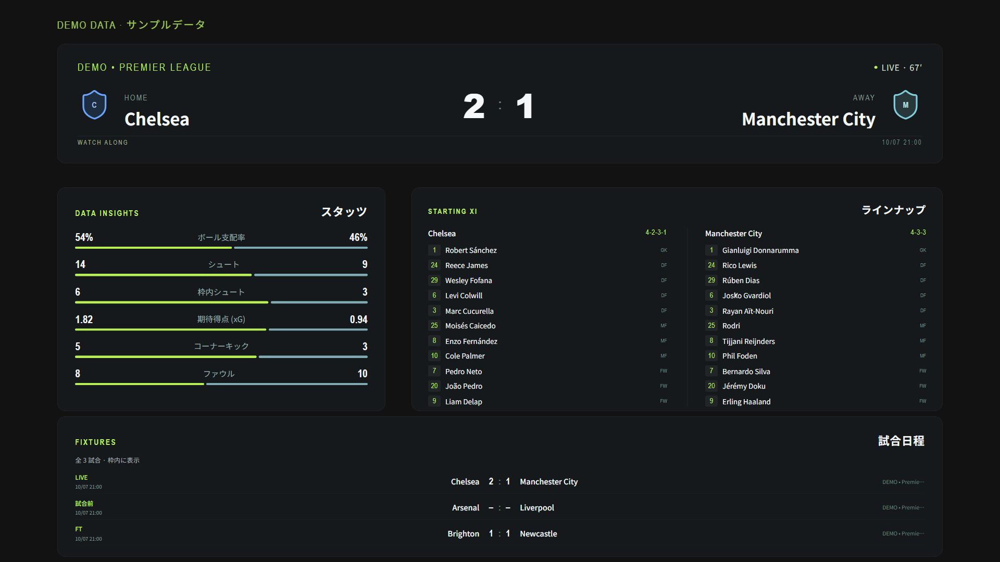

# fot-api-001

サッカーの YouTube 同時視聴配信用に、試合データを選んで OBS に表示するローカル Web アプリです。Python / FastAPI、React / CSS、Docker で構成しています。映像や中継音声は含みません。



画像は架空のデモデータの表示例です。OBS の出力背景は透過にできます。

## 起動

Windows / macOS は **Docker Desktop**、Linux は **Docker Engine と Docker Compose v2** を用意し、Docker を起動してください。通常の利用では、ホスト側に Python や Node.js をインストールする必要はありません。初回は Docker イメージと依存パッケージを取得するため、ネット接続が必要です。

1. このリポジトリをダウンロードして展開します。Git を使う場合は `git clone https://github.com/Hayasaka-pape/fot-api-001.git`。
2. Windows は **`start.bat` をダブルクリック**します。macOS / Linux は、このフォルダーで `sh start.sh` を実行します。
3. 準備ができると [http://localhost:8000](http://localhost:8000) が開きます。

コマンドで起動する場合:

```sh
docker compose up --build -d
```

停止は Windows の `stop.bat`、macOS / Linux の `sh stop.sh`、または次のコマンドです。

```sh
docker compose down
```

保存した表示設定は Docker の `studio-data` 名前付きボリュームに残ります。`docker compose down -v` は保存設定も削除するため、通常の停止には使わないでください。本番コンテナは root 権限を持たない専用ユーザーで動作します。

## データを選ぶ

「データソース」で取得モードと「データの種類」を選びます。試合詳細は、**日付 → リーグ → 当日の試合** の順に選択します。

1. 「試合」を選び、取得したい日付を指定します。日付や取得モードを変更すると、その日のリーグと試合の候補を自動取得します。
2. リーグのプルダウンから対象リーグを選びます。当日に試合がある開催グループ単位で表示し、同じ親大会に属する別グループも区別します。同名の大会には国コードなどを添えて見分けられるようにしています。
3. 試合のプルダウンから対戦カードを選びます。選択した試合のスコア、スタッツ、ラインナップを自動取得するため、通常は FotMob の ID を調べる必要がありません。

チームとリーグの情報は対象のプルダウン、日付別の全試合は日付を選び、「データを取得」を押します。チーム・リーグは通常の欄から ID を直接入力できます。試合を ID で直接指定する場合は詳細設定の ID 入力を使います。タイムゾーンとタイムアウトも詳細設定から変更できます。

日付別・チーム・リーグで試合日程を取得すると、「取得した日程から試合詳細へ」のプルダウンから対象試合を選び、試合詳細へ切り替えられます。

| データ種別 | 取得・表示の対象 |
| --- | --- |
| チーム | チーム情報、成績、試合日程、選手情報 |
| 試合詳細 | スコア、試合状態、ラインナップ、スタッツ |
| 日付別の試合 | 指定日に FotMob が提供するリーグ別の試合 |
| リーグ | 順位表、試合日程、大会情報 |

初回は **「デモデータ」** で起動します。同梱サンプルを使い、デザインや OBS の接続を確認できます。画面と出力にもデモであることを表示し、デモのスコアや試合は実際のライブ結果ではありません。

**「実データ」** は FotMob の非公式エンドポイントに接続します。元の [bjrsti/fotmob](https://github.com/bjrsti/fotmob) を参考にしています。対象リーグや項目、ライブ更新の可否はデータ提供側に依存し、150 以上のリーグを含む全データの継続取得は保証されません。接続先のアクセス制限や仕様変更によって取得できない場合は、画面にエラーを表示します。制限の回避機能はありません。

## OBS 用の表示を作る

1. 「表示する情報」で必要な項目を選択します。表示パーツはスコアボード、試合スタッツ、ラインナップ、試合日程、順位表、チーム情報、リーグ情報、選手一覧です。
2. 「レイアウトプリセット」から「マッチデー」「ローワーサード」「ミニマル」「スコアボード＋出場選手」を選ぶか、プレビューでパーツをドラッグします。
3. 「レイアウト設定」の「編集するパーツ」でパーツを選び、X・Y、幅・高さ、文字サイズを調整します。アクセント、パネル、文字の色、不透明度、透過背景も設定できます。
4. 「シーンを保存」を押し、生成された **OBS URL** を「URL をコピー」でコピーします。
5. OBS の「ソース」から「ブラウザ」を追加し、URL を貼り付けます。標準設定は **幅 1920 / 高さ 1080** です。

「スコアボード＋出場選手」は試合データのスコアボードとラインナップ（両チームの現在出場選手）の 2 パーツだけを配置します。試合前は先発メンバーを表示し、試合中は交代で退いた選手を外して途中出場選手を追加し、退場も反映します。自動更新は最短 30 秒で、終了後は最終出場選手を表示します。交代・退場データが不足して現在の選手を確定できないチームは、選手一覧の代わりに理由を表示します。フォーメーションは試合開始時の情報です。位置やサイズの追加調整、シーン保存、OBS URL、ZIP 出力は他のプリセットと同じ手順です。

ブラウザソースの URL は `http://localhost:8000/overlay/<保存設定のID>` です。Docker を動かしているパソコンと OBS を同じパソコンで使用してください。キャンバスの背景を透明にすれば、カメラなどの他のソースに重ねられます。

設定を変更して再保存すると、同じ URL の表示にも反映されます。ライブモードでは保存した更新間隔で取得します。OBS の自動更新は最短 30 秒で、サーバー側キャッシュにより短時間の重複リクエストを抑えます。取得失敗の理由を確認でき、正常なデータがある場合は直前の表示を保ちます。「マイシーン」から保存済みのシーンを開くか、新しいシーンを作成できます。

管理画面と OBS URL のパーツは、スタッツは先頭 6 項目、日程は 16 試合、順位表は 24 チーム、選手一覧は 30 選手まで表示します。件数はパーツ内で確認でき、枠に収まらない場合は幅・高さや文字サイズを調整してください。JSON は選択した項目の全件を含みます。

## JSON と HTML / CSS を出力する

プレビュー横の「JSON」タブで選択した情報のみを確認し、「保存」で JSON を取得できます。シーンの保存後に「HTML / CSS / JSON を ZIP で保存」から OBS 用ファイル一式をダウンロードできます。

ZIP には `index.html`、`style.css`、`overlay.js`、`data.json`、`config.json` が含まれます。展開後に `index.html` を開くと、ダウンロード時点のデータと配置を表示できます。OBS のブラウザソースで「ローカルファイル」を選び、展開した `index.html` を指定することもできます。

**ZIP は取得時点のスナップショットです。ライブ更新や保存後の設定変更を反映する場合は OBS URL を使ってください。**

ラインナップの JSON は `players` に現在出場選手、`startingPlayers` に元の先発メンバーを保持します。途中出場選手には出場時刻の `enteredAt` を含みます。ZIP でも書き出し時点の選手一覧と状態を保持し、その後の交代には追従しません。

## 設定

`.env.example` を `.env` にコピーし、必要な値を変更します。変更後は `docker compose up -d` を実行してください。

| 設定 | 初期値 | 内容 |
| --- | --- | --- |
| `HOST_PORT` | `8000` | 管理画面と OBS URL のポート |
| `TIMEZONE` | `Asia/Tokyo` | 日付・試合時刻に使う IANA タイムゾーン |
| `FOTMOB_TIMEOUT` | `10` | 外部 API のタイムアウト秒数 |

取得時のタイムアウトとタイムゾーンは管理画面からも選択できます。ポートを変更した場合は、OBS の URL も変更してください。標準構成は `127.0.0.1` に公開し、このパソコンからアクセスできます。

## トラブル時

```sh
docker compose ps
docker compose logs --tail 100 studio
```

起動できない場合は、Docker が起動しているか、8000 番ポートが他のアプリで使用されていないか確認してください。ポートが重複するときは `.env` の `HOST_PORT` を変更します。ライブ取得だけが失敗するときはデモで表示を確認し、画面のエラー詳細を確認してください。

## 開発

```sh
# Python 3.12 / Node.js 22
python -m venv .venv
# Windows: .venv\Scripts\activate
# macOS / Linux: . .venv/bin/activate
python -m pip install -r backend/requirements-dev.txt
```

別々のターミナルでバックエンドとフロントエンドを起動します。

```sh
cd backend
uvicorn app.main:app --reload --host 127.0.0.1 --port 8000
```

```sh
cd frontend
npm ci
npm run dev
```

API 仕様は起動後の [http://localhost:8000/docs](http://localhost:8000/docs) で確認できます。カスタムエラーは入力エラー、タイムアウト、接続失敗、アクセス制限、応答形式の問題などを区別し、HTTP ステータスと理由を返します。

主な API:

| メソッド・パス | 用途 |
| --- | --- |
| `GET /api/health` | 起動状態の確認 |
| `POST /api/match-options` | 指定日のリーグ別の試合選択候補を取得 |
| `POST /api/query` | 選択した試合・チーム・日付・リーグの情報を取得 |
| `GET /api/scenes` / `POST /api/scenes` | 保存したシーンの一覧・新規保存 |
| `GET` / `PUT` / `DELETE /api/scenes/{id}` | シーンの読み込み・更新・削除 |
| `GET /api/scenes/{id}/data` | 保存したシーンの選択項目を JSON で取得 |
| `GET /api/scenes/{id}/export` | HTML・CSS・JSON の ZIP を取得 |
| `GET /overlay/{id}` | OBS 用のブラウザページ |

試合選択候補の入力例:

```json
{
  "date": "2026-10-07",
  "timezone": "Asia/Tokyo",
  "timeout": 10,
  "mode": "demo"
}
```

`/api/match-options` は `source`、`fetchedAt`、`warnings` と、`leagues` 配列を返します。各リーグは `id`、`name`、`matches` を持ち、各試合は `id`、対戦チーム名、スコア、状態、開始時刻、`leagueId` を持ちます。開催グループの `id` を優先し、親大会の `primaryId` で別グループをまとめません。取得した試合の `id` を `/api/query` の `kind: "match"` と組み合わせて詳細を取得できます。無効な日付は HTTP 422 と `VALIDATION_ERROR` で返します。

テストと本番ビルド:

```sh
cd backend
python -m pytest tests -q
cd ..
cd frontend
npm ci
npm run build
```

Docker 起動後の動作確認は、リポジトリのルートで実行します。

```sh
python scripts/smoke.py --base-url http://127.0.0.1:8000
```

GitHub Actions は `main` への push でバックエンドテスト、フロントエンドビルド、Docker ビルドとデモ・保存・出力の動作確認を実行します。ライブ API の疎通は外部サービスに依存するため、CI はデモデータを使用します。

`scripts/smoke.py` は、試合候補の複数リーグへのグループ分け、選択した試合と詳細の対戦チームの一致、無効な日付の HTTP 422 を確認します。デモの交代で退いた選手の除外、途中出場選手と出場時刻の追加、元の先発メンバーの保持を確認し、保存したシーンの JSON と ZIP に同じ現在出場選手が残ることも検証します。既存の 4 種類の取得、保存・OBS ページの確認も含みます。

## ライセンス

このソフトウェアは [MIT License](LICENSE) です。参考にした FotMob クライアントの著作権・ライセンスは [THIRD_PARTY_NOTICES.md](THIRD_PARTY_NOTICES.md) に記載しています。取得データ、名称、チームやリーグのマーク等の権利は各権利者に帰属します。
